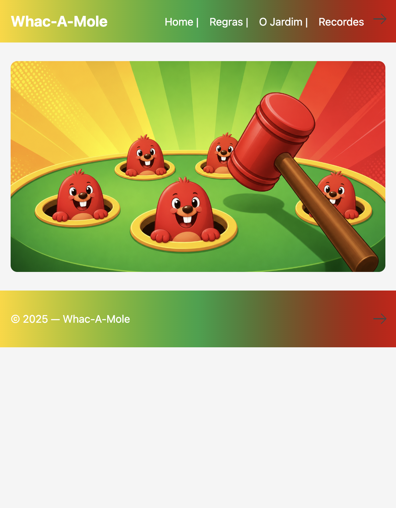

# Whac-A-Mole Project

Projeto desenvolvido como primeiro trabalho da pos-graduacao da PUC-Rio, com evolucao de layout, organizacao de codigo e melhoria da experiencia de jogo.

## Onde esta o site principal

- Pasta principal no repositorio: [meu-site](meu-site)
- Home local: [meu-site/index.html](meu-site/index.html)
- Tabuleiro: [meu-site/tabuleiro.html](meu-site/tabuleiro.html)
- Recordes: [meu-site/recordes.html](meu-site/recordes.html)

## Demo Online

- Site publicado: https://acodmin.com/curso-exemplos/meu-site/index.html
- Repositorio: https://github.com/Elainecbr/Whac-A-Mole-project

## Visao Geral

Este projeto recria o jogo classico Whac-A-Mole em pagina web, com:

- navegacao entre paginas (home, regras, tabuleiro e recordes)
- tabuleiro interativo com pontuacao em tempo real
- ranking Top 10 com persistencia no navegador (localStorage)
- design responsivo e componentes reutilizaveis

## Capturas de Tela

### Home



### Tabuleiro


### Recordes


## Funcionalidades

- Inicio e parada de partida por botoes START/PARAR
- Cursor customizado de martelo durante o jogo
- Sistema de pontos por acertos, perdidos e erros
- Salvamento de resultado no ranking ao encerrar partida
- Painel de recordes com:
  - ordenacao por pontuacao, data ou nome
  - cadastro manual de pontuacoes
  - metricas de melhor pontuacao, total de jogadores e media

## Estrutura de Pastas

```text
Whac-A-Mole-project/
  meu-site/
    index.html
    regras.html
    tabuleiro.html
    recordes.html
    css/
      style.css
    javascript/
      jogo.js
      recordes.js
    images/
  docs/
    screenshots/
```

## Tecnologias

- HTML5
- CSS3
- JavaScript (Vanilla)
- LocalStorage para persistencia local de ranking

## Como Executar Localmente

1. Clone o repositorio:

```bash
git clone https://github.com/Elainecbr/Whac-A-Mole-project.git
```

2. Acesse a pasta do projeto:

```bash
cd Whac-A-Mole-project/meu-site
```

3. Abra o arquivo `index.html` no navegador.

Opcional: use uma extensao como Live Server no VS Code para navegação local com recarregamento automatico.

## Melhorias Aplicadas nesta Versao

- Reestruturacao da pagina de recordes para layout profissional
- Criacao de script dedicado para ranking dinamico (`recordes.js`)
- Integracao do fim de jogo com envio automatico de pontuacao para o ranking
- Ajustes de responsividade e legibilidade no CSS

## Proximos Passos

- Persistencia de ranking em backend (Firebase, Supabase ou API propria)
- Autenticacao de jogadores
- Efeitos sonoros e niveis de dificuldade
- Testes automatizados de regras de pontuacao

## Licenca

Uso educacional e demonstrativo.
